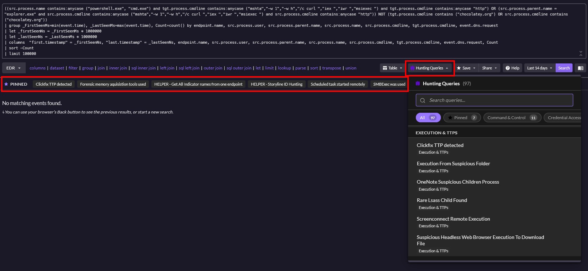
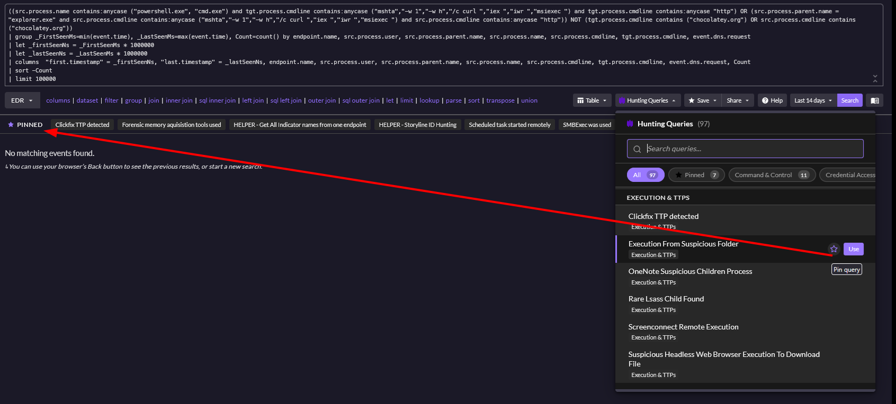
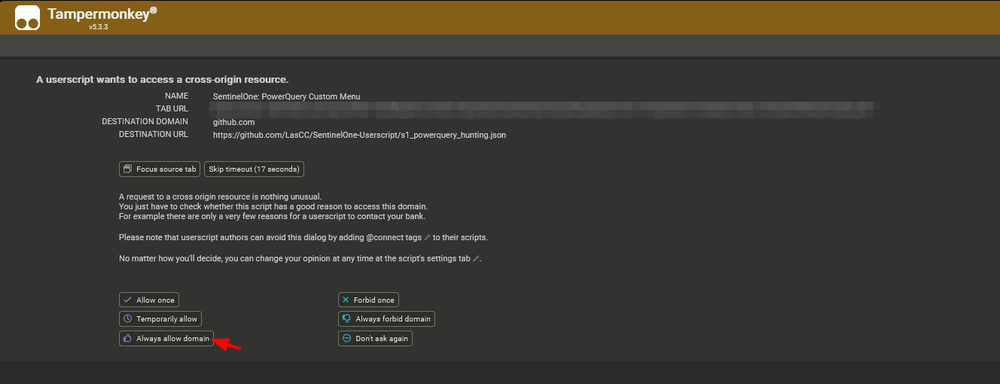

# SentinelOne PowerQuery Custom Menu - Userscript

A userscript that enhances the SentinelOne PowerQuery interface with a custom threat hunting button that follow the website UI / UX design interface.



## Features

- **Custom Hunting Queries Menu**: Access a curated collection of threat hunting queries organized by category
- **Query Pinning**: Pin frequently used queries for quick access
- **Search \& Filter**: Search through queries by name or description
- **Cell Copy Buttons**: One-click copy functionality for **each** query result cell
- **Compact UI**: Clean, organized interface that integrates seamlessly with SentinelOne



## Installation

1. Install a userscript manager like [Tampermonkey](https://www.tampermonkey.net/) or [Greasemonkey](https://www.greasespot.net/)
2. Click [here](https://raw.githubusercontent.com/LasCC/SentinelOne-Userscript/refs/heads/master/userscript.js) to install the script
3. The script will automatically load when you visit SentinelOne PowerQuery pages

After the first installation there will be a Tampermonkey popup asking to allow the fetch to grab all the detection rules. You need to click the button "Always allow domain".



## Default Rules

By default, the script comes with a comprehensive set of pre-configured threat hunting rules covering various categories such as:

- Installation \& Persistence
- Process Execution
- Network Activity
- Registry Modifications
- File System Activity
- And more...

## Customizing the Rules Source

You can modify the script to use your own custom rules by changing the `QUERIES_URL` constant. Here's how:

```diff
- const QUERIES_URL = "https://raw.githubusercontent.com/LasCC/SentinelOne-Userscript/refs/heads/master/s1_powerquery_hunting.json";
+ const QUERIES_URL = "https://your-domain.com/path/to/your/custom-rules.json";
```

## Rules Format

The JSON file should contain an array of rule objects with the following structure:

```json
[
    {
        "category": "Installation & Persistence",
        "name": "EpiBrowser and OneStart installation",
        "query": "your rule (json encoded)"
    },
]
```


### Required Fields

- **category**: The category name for organizing queries (e.g., "Network Activity", "Process Execution")
- **name**: Display name for the query
- **query**: The actual detection query


## Usage

1. Navigate to any SentinelOne PowerQuery page (`*.sentinelone.net/query*`)
2. Look for the "Hunting Queries" button in the toolbar
3. Click to open the dropdown menu with all available queries
4. Use the search bar to find specific queries
5. Filter by category using the tabs
6. Click on any query to execute it immediately
7. Use the star icon to pin/unpin frequently used queries

## Browser Compatibility

- Chrome/Chromium-based browsers with Tampermonkey
- Firefox with Greasemonkey or Tampermonkey

## Contributing

Feel free to contribute additional hunting queries, bug fixes, or feature improvements by submitting pull requests to the [GitHub repository](https://github.com/LasCC/SentinelOne-Userscript).